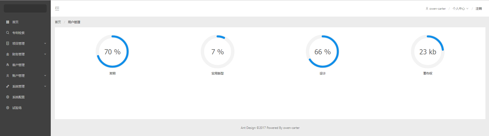
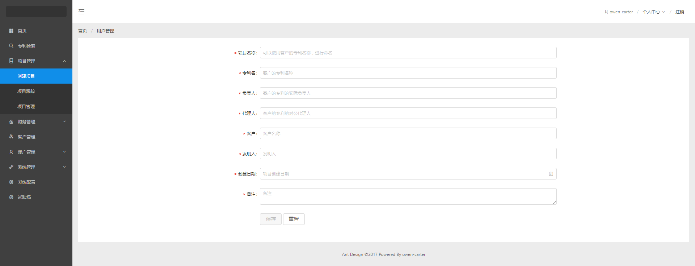
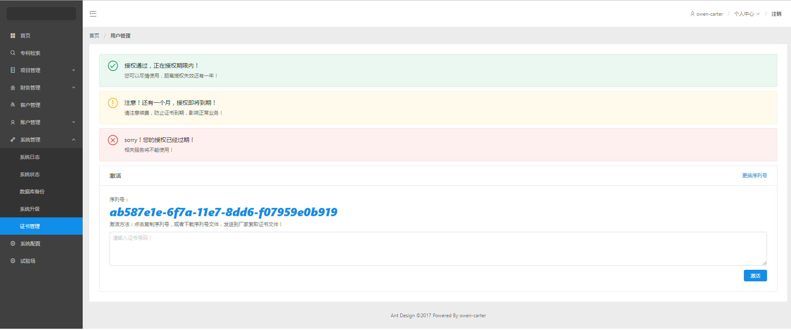
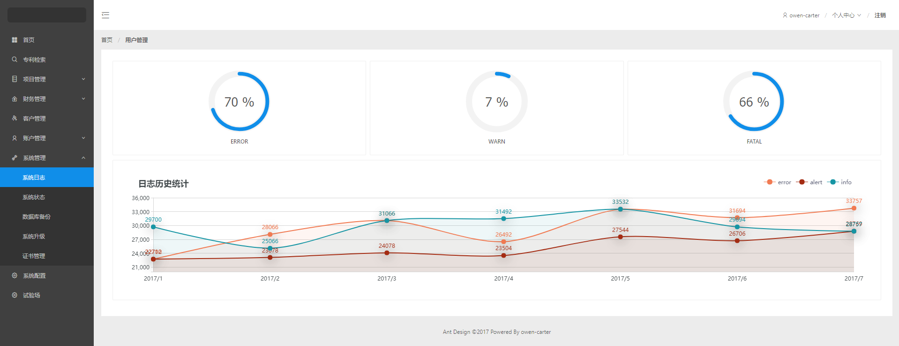
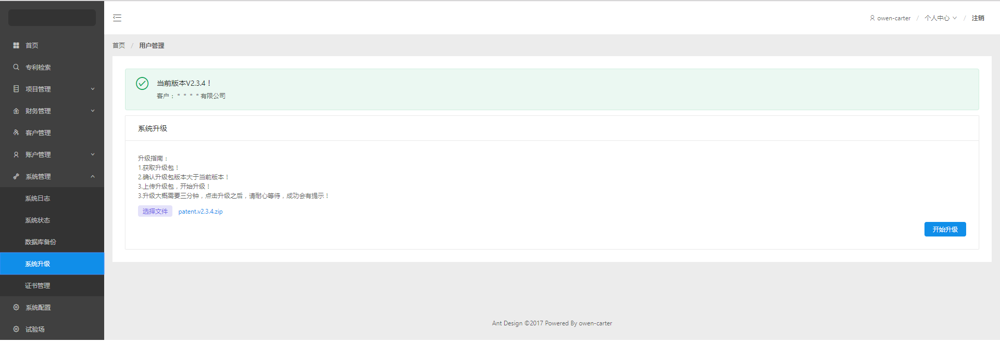

# ZorroAdmin  

This project was generated with [Angular CLI](https://github.com/angular/angular-cli) version 1.3.1

## how to start?

- Run `ng serve` for a dev server

- Run `ng build` to build the project.

- Run `ng test` to execute the unit tests via [Karma](https://karma-runner.github.io).

- Run `ng e2e` to execute the end-to-end tests via [Protractor](http://www.protractortest.org/).

- Before running the tests make sure you are serving the app via `ng serve`.

### screen

