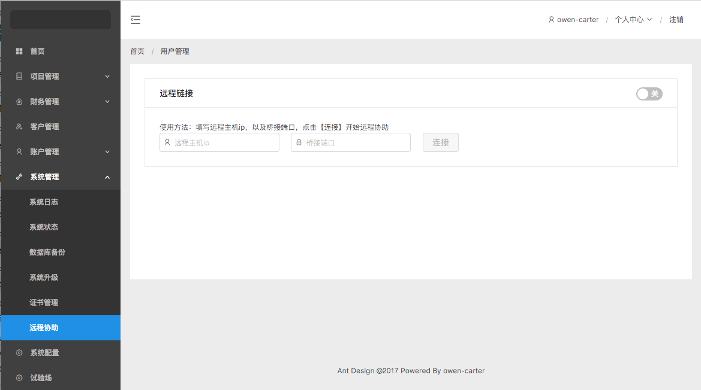

# ZorroAdmin  

This project was generated with [Angular CLI](https://github.com/angular/angular-cli) version 1.3.1

### How to start?
```bash
git clone https://github.com/owen-carter/ng-zorro-admin.git
cd ng-zorro-admin
npm install -g @angular/cli
npm install
npm run start
```

### About proxy setting
> please read the ./proxy.conf.json
```json
{
  "/api": {
    "target": "http://localhost:3000",
    "secure": false
  }
}
```

### How to deploy?
```bash
sh ./deploy.sh deploy
```


### About nginx cong
```bash
upstream patent {
    server 127.0.0.1:3000;
    keepalive 2000;
}
server {
        listen       80 default_server;
        listen       [::]:80 default_server;
        server_name  owen-carter.com;
        root         /usr/share/nginx/html/patent/;

        location / {
	        # index.html;
        }

        location /api/ {
            proxy_pass http://patent;
            proxy_set_header Host $host:$server_port;
        }

        error_page 404 /404.html;
            location = /40x.html {
        }

        error_page 500 502 503 504 /50x.html;
            location = /50x.html {
        }
}
```


### ScreenShoot





### Changelog
+ 现有版本
  - 远程协助
  - 日志管理
  
+ v1.0.0.1
  - 远程协助
  - 日志管理
  - 系统升级
  - 数据库备份
  - 证书管理

